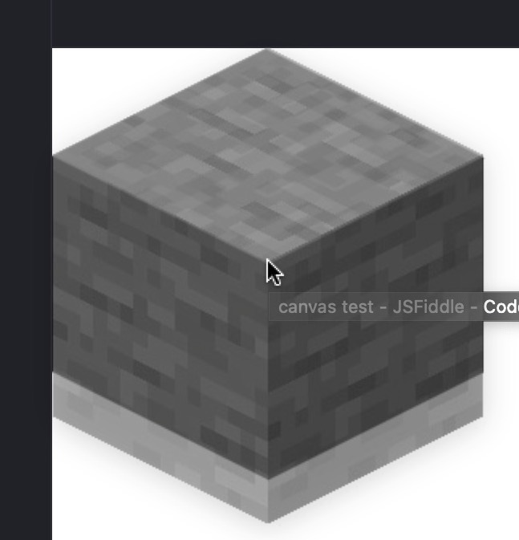
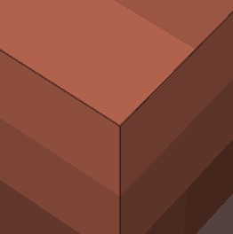

<p align="center">
  
</p>

#### Minecraft sprites to isometric cube render.

With only few steps your can render you own __actual__ minecraft blocks icons.

## Install
```
npm i -g minecraft-blocks-render

or

yarn global add minecraft-blocks-render
```

## Usage
To render blocks, you need get sprites. So we can just grab it from any `.jar` file, wich you can find on `/minecraft/versions/YOUR_VERSION/x.xx.x.jar` after installing it from launcher.

https://help.minecraft.net/hc/en-us/articles/360035131551-Where-are-Minecraft-files-stored-

|OS|path|
|---|---|
|OSX|`~/Library/Application\ Support/minecraft/versions`|
|Windows|`%AppData%/.minecraft/versions`|
|Linux|`~/.minecraft/versions`|

## mbr grab

#### options

|option|description|required|
|---|---|---|
|`-f`, `--file`|Load a file|true|
|`-d`, `--debug`|Shows debug info of extraction|false|

##### Example: `bin grab -f 1.16.2.jar -d`

Make any folder and put `.jar` file on it.

And run command `mbr grab` on it

```
cd my-folder
mbr grab
```

`grab` will copy folders `block` and `item` from `/assets/minecraft/textures` in .jar file to local folder called `grab`

## mbr render

#### options

|option|description|required|default|
|---|---|---|---|
|`-r`, `--reducer`|Image bit depth reducer. Bigger number will do more color reduce.|false|`1`|
|`-s`, `--scale`|scale image without reducing quality. `Warning!` May cause edges bugs|false|`1`|
|`-t`, `--type`|`base` will generate JSON file where key - block name, value - base64 string. `png` will render png images for each block|true||
|`-d`, `--debug`|Shows debug info of extraction|false||

##### Example: `mbr render -t base -r 32 -s 10 -d`

After grabbing sprites you can render your blocks with command `mbr render`

If you use type `png` all output images will be saved to `grab/rendered`

Type `base` will save your renders to JSON file `grab/rendered.json`. Where key — bukkit name, value — base64 string.

##### rendered.json example
```
{
  "ACACIA_LOG": "",
  ...
```

You can test base64 images here https://base64.guru/converter/decode/image

### TODO

We have few ideas for project improvement. You can help by sending PR 🤗

- [x] create npm package
- [ ] `renderSides` option for render command (allow render even `*_top`/`*_bottom`/etc blocks)
- [ ] `renderTransparent` option for render command (allow render block with transparent textures)
- [ ] `noShadow` option for render command
- [ ] `name` option for render command (allow render only one block by name)
- [ ] `items` to base64 converter
- [ ] cleaning up `items` from extra icons like `clock_09` or `bow_pulling_1`
- [ ] add more info to json like in-game item ID and old style ID
- [ ] add tests


### Some researches

Without looking in minecraft code we created almost same looking 3D preview of block, like inventory one.

#### Width


As we know, width of cube in isometric projection is 1/sqrt(3) by ISO 5456-3. But as we can read [here](https://www.compuphase.com/axometr.htm), games often use 1/2 (0.5). Minecraft is no exception, so we used 1/2 width formula and +20% height of front sprites to make it similar with game;



#### shadows



On sides of a block we see 2 different shadows. By doing some math [@Kurikaeshiru](https://github.com/Kurikaeshiru) found regularity in RGB shifts. So we just shift each value of RGB with formula

`color /= 1.25 * multiplier`

Multiplier used for second shadow, which darker
